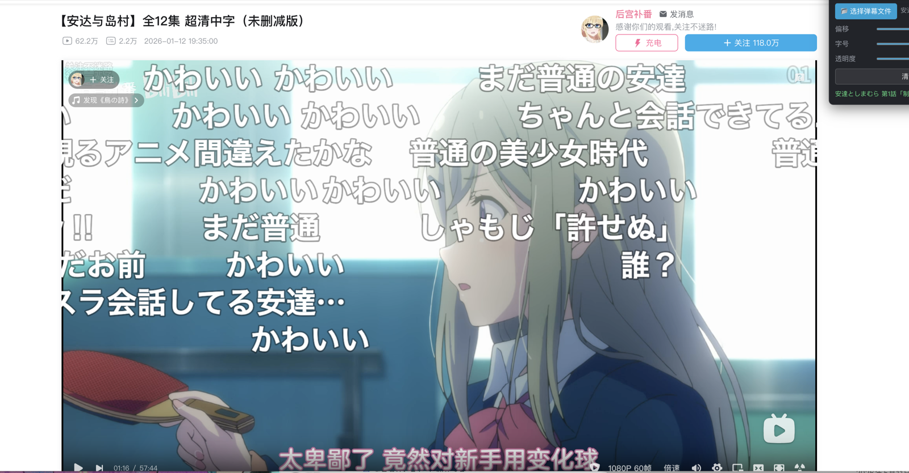
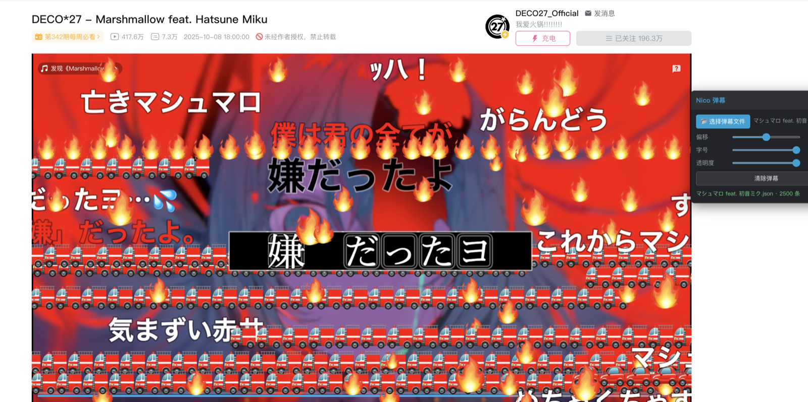

# bili-nico-danmaku-extension

B 站(ビリビリ)の Web プレイヤーでニコニココメントをそのまま再生できる Chrome 拡張機能(MV3)。

ニコニコのコメントファイル(JSON/XML)を選ぶだけで、ニコニコ風のコメントが B 站の動画に重なって表示されます。タイムラインのずれはオフセット調整で合わせられます。

[中文](README.md) | [English](README.en.md) | **日本語**

## スクリーンショット





## インストール

1. Chrome → `chrome://extensions` →「デベロッパー モード」をオン
2.「パッケージ化されていない拡張機能を読み込む」→ このディレクトリ(`manifest.json` がある階層)を選択
3. 任意の B 站 動画/番組ページを開くと、右上に「Nico コメント」パネルが表示されます

## 使い方

1.「📂 コメントファイルを選択」でコメントファイルを読み込み
2. 動画を再生するとコメントが滑らかに同期します(rAF dt 累積クロック、動画のフレームレートに依存しない 60fps 均一な移動)
3. B 站の動画とニコニコ本家のタイムラインがずれている場合は「オフセット」スライダーで調整(正=コメントが早い、負=遅い)
4. フォントサイズ/不透明度は即時反映;B 站 本来のコメントはプレイヤー標準のコメント表示スイッチで制御

### 自動記憶

- ファイルを読み込むと**動画 ID(bvid/ep/p)+ オフセット**を自動で記憶
- ローカルファイルは **File System Access API のハンドル**(IndexedDB)で記憶:次回はディスク上の元ファイルを直接開いて最新内容を読み込み、ストレージを圧迫しません。ハンドルが使えない場合はファイル内容の保存に自動フォールバック
- 同じ動画を開き直す/リロードすると**コメントとオフセットを自動復元** — ファイルを選び直す必要なし
- **エピソード/パート切り替えで対応するコメントを自動ロード**:1 話のコメントを 2 話に切り替えると 2 話のコメントが読み込まれ、戻すときも同様
-「コメントをクリア」= 現在の動画との関連付けを解除(次回は自動ロードされない。他の話には影響なし)

設定(オフセット、フォントサイズ、不透明度)は `chrome.storage.local` に保存され、次回自動復元されます。

## 対応するコメントファイル形式

| 形式 | 説明 |
|---|---|
| nico v1 JSON | ニコニコ公式 API 形式、`[{fork, comments:[{vposMs, body, commands, postedAt, ...}]}]` |
| nico XML | 生の `<packet>` / `<chat>` コメント XML |
| xml2js JSON | `{packet:{chat:[...]}}` |
| legacy / formatted | 旧 niconicomments JSON / Niconicome 書き出し |
| B 站 XML | おまけ対応、ニコニコ風に描画 |

## アーキテクチャ

- `content.js` — プレイヤー検出、overlay マウント、ファイル読み込み、rAF 同期ループ、オフセット/フォント/不透明度、SPA 再マウント(MutationObserver)。パネルは動画ページ(/video/、/bangumi/play/、/list/)でのみ作成
- `content.css` — パネル UI
- `lib/bundle.js` — [niconicomments](https://github.com/xpadev-net/niconicomments) v0.3.1 バンドル(CSSRenderer 含む)
- `lib/input.js` — XML/JSON パース(iina-plugin-danmaku-cosmos と同一)
- `test-data/sample-nico.json` — v1 形式のテスト用コメント 68 件
- `test/harness/index.html` — ローカルテスト環境:bpx プレイヤーの DOM と実動画を再現し、拡張機能と同一ファイルでエンジン/同期/UI を検証

### エンジン連携メモ

- エンジン: [niconicomments](https://github.com/xpadev-net/niconicomments) (xpadev-net)
- 描画: ネイティブ canvas モード(`mode: 'default'`)、内部は **WebGL2**(失敗時 Canvas2D にフォールバック)、1920×1080 内部解像度を CSS で host いっぱいに伸長
- overlay host(絶対配置で動画枠を埋める)の中に `<canvas>` を置き、`width/height:100%` で伸長、`pointer-events:none`、不透明度はパネルで制御
- コメント同期: rAF dt 累積クロック(nico-comment-dl preview と同じ方式)——再生/シーク/復帰時に `video.currentTime` へ再アンカーし、その後はメディアフレーム単位の補正なしで自由動作(メディアクロックのジッターは補正すると逆に微細なガタつきを生むため)。浮動小数点 vpos を毎フレーム `drawCanvas` に渡す。シーク差 >1.5s で `clear()` して再描画。一時停止中は最終フレームを保持し、シーク時のみ再描画
- 上流 v0.3.1 の `isMode` 検証は `default/html5/flash` のみ受け付け(CSS 描画モードのコードはバンドル内にあるが検証に接続されていない)ため、canvas モードで統一

## テスト

```bash
cd bili-nico-danmaku-extension
# 初回のみ: テスト動画を生成 (gitignore 済み)
ffmpeg -y -f lavfi -i testsrc2=size=960x540:rate=30:duration=90 \
  -f lavfi -i sine=frequency=440:duration=90 \
  -c:v libx264 -pix_fmt yuv420p -preset ultrafast -crf 32 -c:a aac -b:a 96k \
  test/harness/test.mp4
node test/harness/server.js 8766   # Range 対応の静的サーバー (python http.server は非対応で Chrome のメディアシークが壊れる)
# http://127.0.0.1:8766/video/index.html を開く (video/ はテスト環境へのシンボリックリンク。/video/ URL 形態の再現)
```

テスト環境のコンソールでの自動化フック: `window.postMessage({type:'nico-dm:load', name:'x.json', text:JSON.stringify(SAMPLE)}, '*')`。

## 既知の制限

- コメントのクロックは再生/シーク/バッファ復帰時に動画へ再アンカー。バッファリング中(`waiting`)は凍結し、`playing` で再調整
- 全画面表示時、パネルは fullscreen 要素の外にあるため非表示になります(コメント自体はプレイヤーと一緒に全画面表示されます)
- CA コメントの `@jump` は無視(ブラウザ環境に複数動画切り替えの意味がないため)
- B 站 本来のコメントには関与しない:プレイヤー標準のコメント表示スイッチで制御
- ファイルハンドル方式(File System Access API)は Chrome のみ対応。Firefox/Safari は自動的に「ファイル内容の保存」フォールバック
